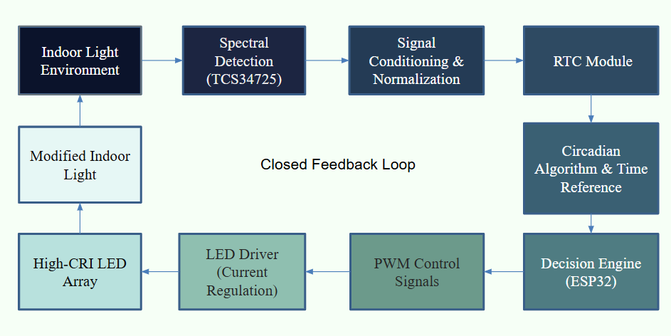
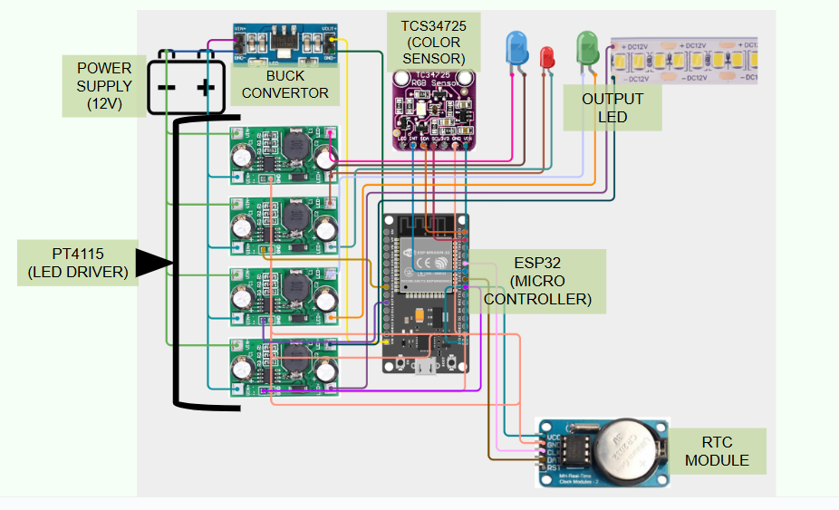

# 🌞 Chrono-Solar – Adaptive Circadian Light Therapy System

## Team: Photon Freaks
 
**Team Members:**  
- Pranav Gajghat  
- Pandurang Jadhav  
- Krushna Chatuphale  
- Ompranal Dhokchaule  

---

## 🧠 Problem Overview
Circadian rhythm disruption caused by inadequate exposure to natural sunlight is a major contributor to sleep disorders, Seasonal Affective Disorder (SAD), and reduced mental well-being. Indoor environments such as hospitals, hostels, and offices often lack biologically effective sunlight wavelengths.

---

## 💡 Proposed Solution
**Chrono-Solar** is an adaptive, IoT-enabled circadian lighting system that dynamically modifies indoor lighting to mimic the natural spectral progression of sunlight throughout the day. The system senses ambient light quality and restores circadian-effective wavelengths in real time.

---

## 🔁 System Working Flow

Ambient Light + Time of Day → Spectral & Intensity Detection (TCS34725) → Circadian Algorithm → PWM Control (ESP32) → LED Driver → Adaptive Circadian Lighting → Dashboard Monitoring (Closed Loop)
---

## 🧩 System Architecture

**Core Components:**
- ESP32 Microcontroller  
- TCS34725 Color Sensor  
- PT4115 Constant Current LED Driver  
- RTC Module  
- Buck Converter  
- High-CRI LED Array  
- 12V LED Strip
---

## 🔄 Input–Output Processing Block

To simplify system understanding, the complete sensing-to-actuation pipeline is treated as a single functional block.
Single Processing Block Includes:

Inputs:
Ambient indoor + natural light
Real-time RGB and clear light intensity values
Time reference from RTC

Processing:
Circadian rhythm–based decision algorithm
Comparison with ideal sunlight profile for that time of day

Outputs:
PWM-controlled Blue LED intensity and spectral adjustment for circadian stimulation
PWM-controlled Cool White LED for higher color temperature and alertness enhancement
PWM-controlled Warm White LED for lower color temperature and visual comfort
Dynamic adjustment of ambient color temperature to match circadian requirements
Real-time system status and sensor data visualization on the IoT dashboard

## 📊 IoT Dashboard & Monitoring

The system includes a web-based dashboard for real-time monitoring and reference guidance.
Dashboard Displays:
Ideal light intensity and color temperature based on time of day
Morning: Higher blue-enriched light
Afternoon: Neutral balanced spectrum
Evening/Night: Warm, low-intensity light

Live TCS34725 sensor readings, including:
Red, Green, Blue values
Clear light intensity
System status, PWM levels, and lighting mode
Remote monitoring and future scope for manual overrides

This dashboard helps users understand what the lighting should be and what the environment currently provides, ensuring effective circadian alignment.

## 📈 Scalability & Cost Analysis
- Existing commercial solutions: ₹8,000 – ₹12,000  
- Chrono-Solar prototype cost: ₹2,000 – ₹2,500  
- Projected mass production cost: ₹900 – ₹1,200  

---

## 🏥 Applications
- Hospitals and ICUs  
- Elderly care facilities  
- Hostels and dormitories  
- Offices with limited daylight  
- Mental health and sleep therapy environments  

---

## 🚀 Future Scope
- Integration with wearable health data  
- Personalized circadian therapy profiles  
- Centralized multi-room control  
- Clinical-grade validation  

---

